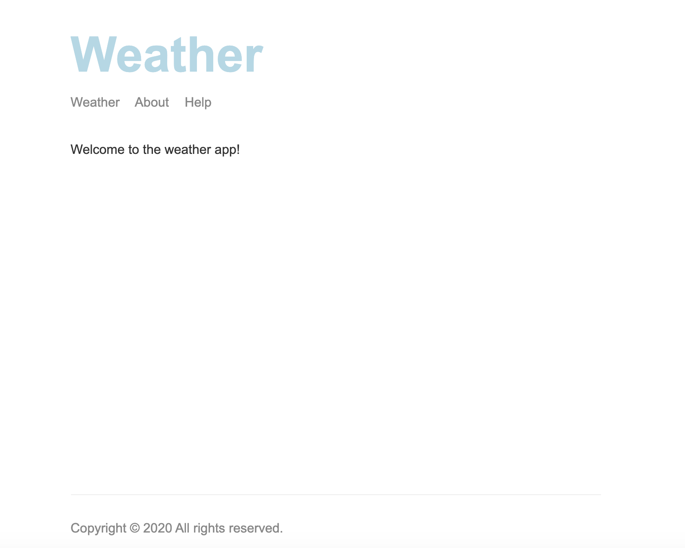

# Web server

Pratice Nodejs. Create an API server with Express.

## To install and run the code

1. Fork the repo
2. Run `$ npm install`
3. Run `$ node src/app.js`
4. Visit http://localhost:3000

See the example:

- When page not found

## Tools
hbs
